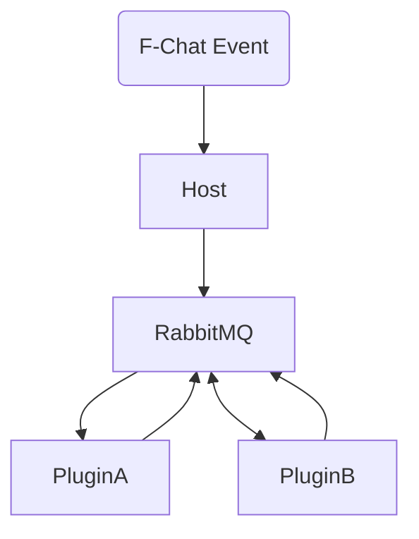

# FChatSharpLib
- .NET Version: 6.0
- This is the repository used as a source for the following NuGet package: https://www.nuget.org/packages/FChatSharpLib/

## HOWTO Run a bot
  - Install the [.NET 6.0 runtime](https://dotnet.microsoft.com/en-us/download/dotnet/6.0)
  - Install [RabbitMQ > 3.0](https://www.rabbitmq.com/download.html). Docker might be the best option.
  - Download and unzip the latest [FChatSharp.Host release](https://github.com/AelithBlanchett/FChatSharp.Host/releases/)
  - Edit the appsettings.json, enter your credentials, the character names, and the RabbitMQ instance infos.
  - Make sure to start your RabbitMQ instance first. Note: you'll have to create a new user with admin permissions if it's not running on 127.0.0.1.
  - Run the FChatSharp.Host.exe
  - Run any other plugins, like [FChatSharp.ExamplePlugin](https://github.com/AelithBlanchett/FChatSharpLib/tree/master/FChatSharp.ExamplePlugin), once the host is started. If the host goes down, the plugins will automatically reconnect to it.

## How does it work?


1. A [FChatSharp.Host](https://github.com/AelithBlanchett/FChatSharp.Host) instance connects to F-chat using your credentials and specified character name.
2. The host receives all the events sent by the F-chat server (new messages, who went online, who joined your channel).
3. The host reads those events, and forwards them to the existing plugins listening to the RabbitMQ message queue.
4. A plugin ([FChatSharp.ExamplePlugin](https://github.com/AelithBlanchett/FChatSharp.ExamplePlugin)) connected to the same RabbitMQ message queue will make actions depending on the event received (most probably a command like !command), and can interact with F-chat through the FChatClient provided inside the class of that plugin.
5. For all the actions relating to F-chat, they are then forwarded back to the Host.
6. The host is the one making the action.


## Usage
In your NuGet Package Manager:

`Install-Package FChatSharpLib -Version 1.0.0-beta`

or with the dotnet CLI tool:

`dotnet add package FChatSharpLib --version 1.0.0-beta`

## Development
Things you need to open the project:
```
- Visual Studio 2022 - https://visualstudio.microsoft.com/downloads/
- .NET 6.0 SDK - https://dotnet.microsoft.com/en-us/download/dotnet/6.0
```

## Contributing

Contact Elise Pariat / Aelith Blanchette on F-list for more information.

## License

This project is licensed under the Apache License 2.0 - see the [LICENSE.md](LICENSE.md) file for details
